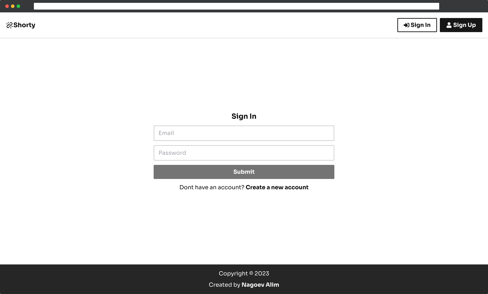
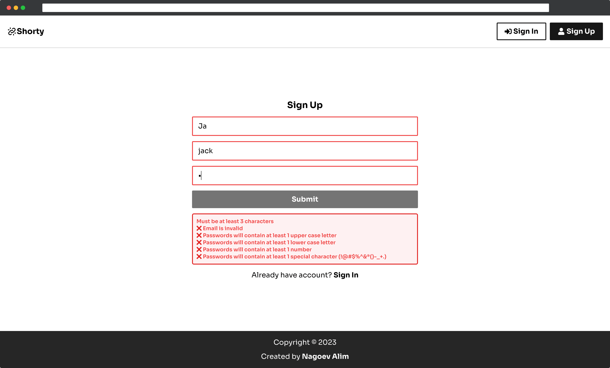
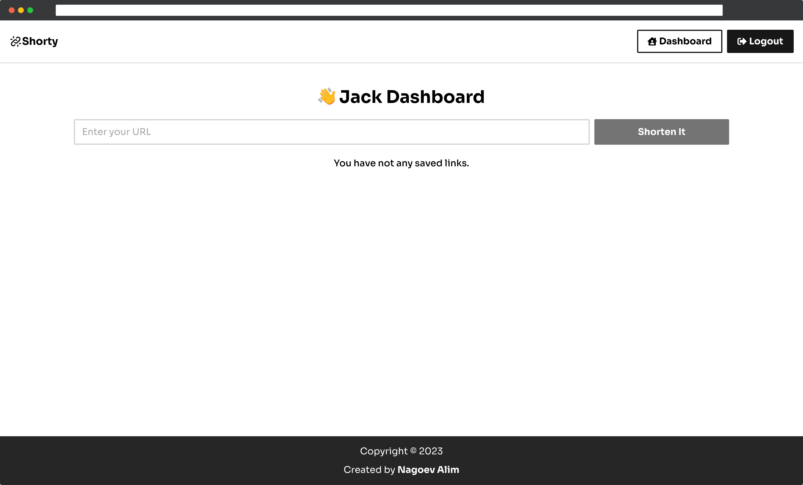

<h2 align="center">🌐 Shorty URL</h2>

📋 In this app you can shorten URL, and store for yourself.

-----

#### 📦 Previews

#### 📦 Dependencies(tech-stacks)
| Client-side                                                          | Description                                                 |
|----------------------------------------------------------------------|-------------------------------------------------------------|
| [react-router](https://github.com/remix-run/react-router)            | Declarative routing for React                               |
| [redux](https://github.com/reduxjs/redux)                            | Predictable state container for JavaScript apps             |
| [tailwindcss](https://github.com/tailwindlabs/tailwindcss)           | A utility-first CSS framework for rapid UI development.     |
| [axios](https://github.com/axios/axios)                              | Promise based HTTP client for the browser and node.js       |
| [react-hot-toast](https://github.com/timolins/react-hot-toast)       | Lightweight, customizable and beautiful by default.         |
| [react-icons](https://github.com/react-icons/react-icons)            | Svg react icons of popular icon packs                       |
| [@uiball/loaders](https://github.com/GriffinJohnston/uiball-loaders) | Lightweight loaders & spinners for your next React project. |
| [generate-react-cli](https://github.com/arminbro/generate-react-cli) | Generate React CLI                                          |

| Server-side                                                         | Description                                                                                                                |
|---------------------------------------------------------------------|----------------------------------------------------------------------------------------------------------------------------|
| [bcryptjs](https://github.com/kelektiv/node.bcrypt.js)              | A library to help you hash passwords.                                                                                      |
| [cors](github.com/expressjs/cors)                                   | CORS is a node.js package for providing a Connect/Express middleware that can be used to enable CORS with various options. |
| [dotenv](github.com/motdotla/dotenv)                                | Dotenv is a zero-dependency module that loads environment variables from a .env file into process.env.                     |
| [express](github.com/expressjs/express)                             | Fast, opinionated, minimalist web framework for Node.js.                                                                   |
| [jsonwebtoken](github.com/auth0/node-jsonwebtoken)                  | An implementation of JSON Web Tokens.                                                                                      |
| [mongoose](github.com/Automattic/mongoose)                          | Mongoose is a MongoDB object modeling tool designed to work in an asynchronous environment.                                |

#### 📦 Routes:

**✏️ Temporary URL:**

| Method | Route  | Description                                            |
|--------|--------|--------------------------------------------------------|
| `POST` | `/`    | Create temporary shorten URL                           |
| `GET`  | `/:id` | Get temporary shorten URL and redirect to original URL |

**✏️ Personal URL:**

| Method   | Route      | Description                                  |
|----------|------------|----------------------------------------------|
| `POST`   | `/url`     | Create shorten URL                           |
| `GET`    | `/url/:id` | Get shorten URL and redirect to original URL |
| `DELETE` | `/url/:id` | Delete shorten URL                           |

**✏️ Users URL:**

| Method | Route             | Description                    |
|--------|-------------------|--------------------------------|
| `POST` | `/users/register` | Register new User              |
| `POST` | `/users/login`    | Login User                     |
| `GET`  | `/users/`         | Get User Info                  |
| `POST` | `/users/refresh`  | Refresh JWT Token Access Token |
