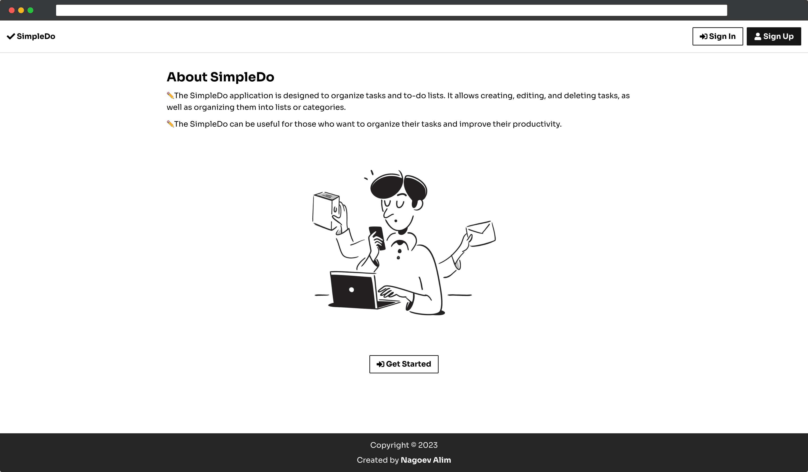
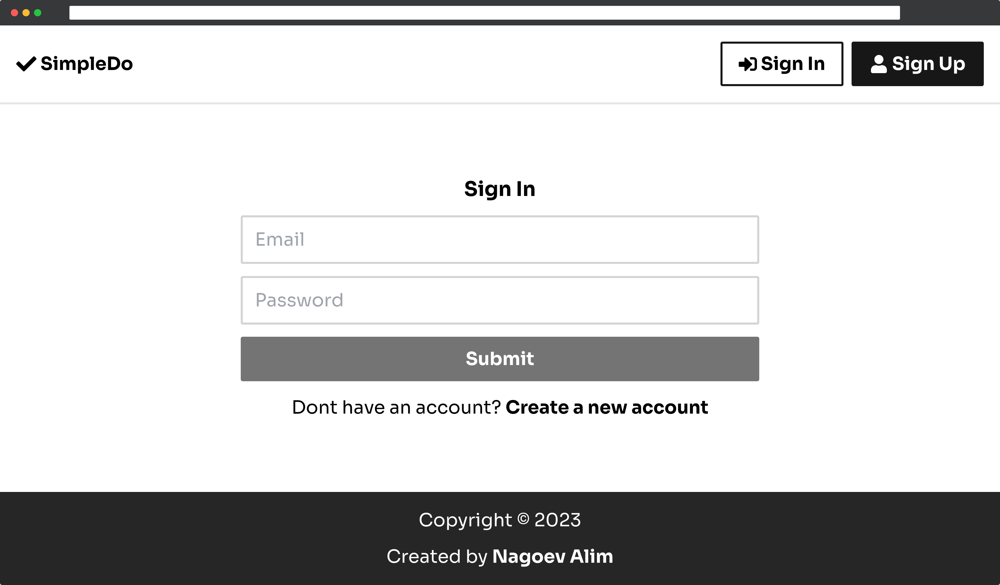
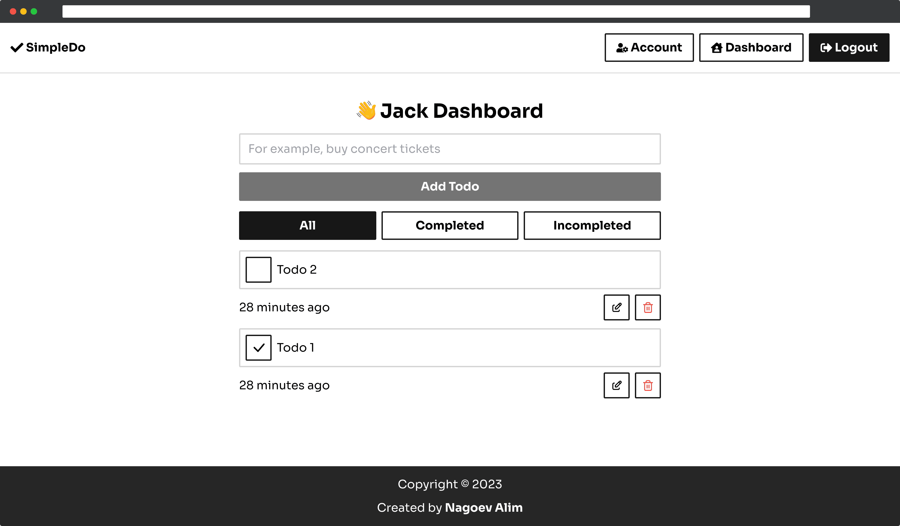
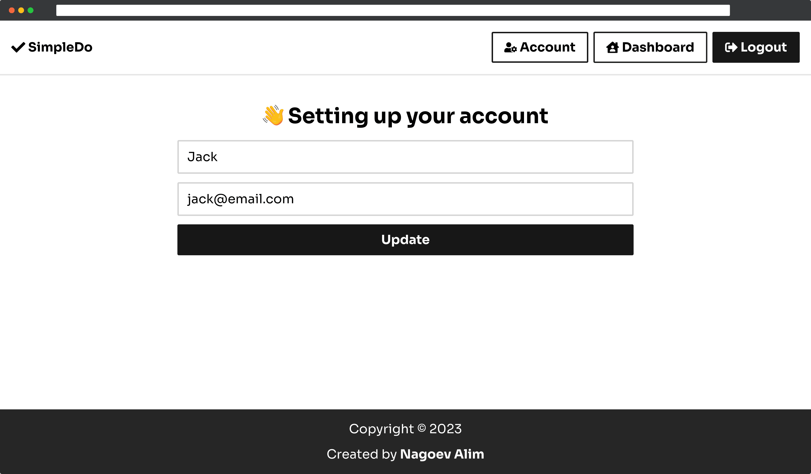
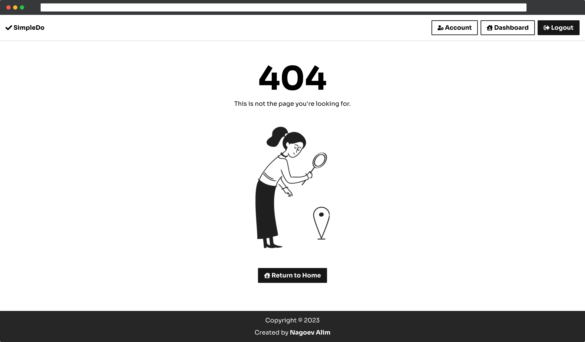

<h2 align="center">🌐 Todo App</h2>

📋 In this app you can create/update/delete todo.

-----

#### 📦 Previews

#### 📦 Dependencies(tech-stacks)
| Client-side                                                          | Description                                                 |
|----------------------------------------------------------------------|-------------------------------------------------------------|
| [react-router](https://github.com/remix-run/react-router)            | Declarative routing for React                               |
| [redux](https://github.com/reduxjs/redux)                            | Predictable state container for JavaScript apps             |
| [tailwindcss](https://github.com/tailwindlabs/tailwindcss)           | A utility-first CSS framework for rapid UI development.     |
| [axios](https://github.com/axios/axios)                              | Promise based HTTP client for the browser and node.js       |
| [react-hot-toast](https://github.com/timolins/react-hot-toast)       | Lightweight, customizable and beautiful by default.         |
| [react-icons](https://github.com/react-icons/react-icons)            | Svg react icons of popular icon packs                       |
| [@uiball/loaders](https://github.com/GriffinJohnston/uiball-loaders) | Lightweight loaders & spinners for your next React project. |
| [generate-react-cli](https://github.com/arminbro/generate-react-cli) | Generate React CLI                                          |
